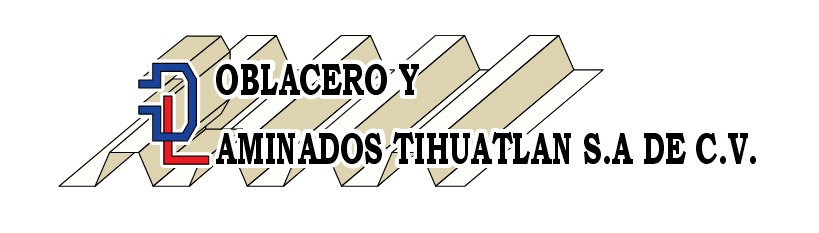

# DoblaWeb - Desarrollo e implementación de un sitio web para promoción de productos

|  Logo de Empresa | Logo del Producto |
| :------------: | :------------: | 
| |   | 

---

## Descripción  
El proyecto consiste en diseñar, desarrollar e implementar un sitio web para una empresa dedicada a la venta de perfil y maquilado de  lámina y placa. Ya que esta no cuenta con una gran presencia en el mundo digital. El sitio web servirá como plataforma para promocionar sus productos de manera clara, accesible y profesional. 

Se utilizarán tecnologías modernas para crear una interfaz interactiva y responsiva. 
El sitio contará con un catálogo dinámico, contenido multimedia, herramientas de contacto directo y un panel administrativo básico para actualizar la información.

Con este proyecto, la empresa podrá aumentar su visibilidad en línea, facilitar la comunicación con clientes potenciales y mejorar su imagen digital, lo que contribuirá a su crecimiento y competitividad en el mercado.

---

## Problemática  
En la actualidad, muchas pequeñas y medianas empresas dedicadas a la comercialización y acondicionamiento de materiales metálicos carecen de una presencia digital sólida que les permita mostrar sus productos de manera eficiente y atractiva. Esta falta de visibilidad en línea limita su capacidad para llegar a nuevos clientes, reducir el tiempo de respuesta ante solicitudes, y competir en un mercado cada vez más digitalizado.

La empresa en cuestión no cuenta con un sitio web que permita a los usuarios conocer su catálogo de productos, ni establecer un contacto directo de forma práctica y accesible. 
Además, no se ha encontrado un sitio web actualizado con la información más reciente sobre la empresa, lo cual reduce aún más el alcance y efectividad de sus canales de promoción.

Esto tambien limita sus oportunidades de crecimiento comercial y posicionamiento en el mercado. Por lo tanto, es necesario desarrollar un sitio web responsivo y dinámico que resuelva estas carencias, mejore la experiencia del usuario (UX) y fortalezca la imagen digital de la empresa.

---

## Propuesta de Solución  
Para resolver la problemática de la falta de presencia digital y promoción eficiente de los productos, se propone desarrollar un sitio web responsivo que permita mostrar un catálogo dinámico de productos de la empresa. Este sitio incluirá información detallada y actualizable, imágenes y opciones de contacto directo como enlaces a WhatsApp o redes sociales.
El sitio estará diseñado para funcionar correctamente en cualquier dispositivo, mejorando la experiencia del usuario y facilitando la navegación. Además, se implementará un panel de administración sencillo que permita a la empresa actualizar el catálogo sin necesidad de conocimientos técnicos avanzados.
El desarrollo se realizará bajo la metodología ágil Scrum, que permitirá organizar el trabajo en etapas, entregar avances constantes y adaptarse a cambios o mejoras durante el proyecto.

---
 
### Objetivo General  
Digitalizar los servicios de la empresa mediante una plataforma web que mejore la experiencia del cliente y optimice sus procesos comerciales.  

---

### Objetivos Específicos  
1. Implementar un catálogo dinámico
2. Garantizar la usabilidad en cualquier tipo de dispositivo
3. Integrar herramientas de contacto directo con la empresa
4. Optimizar el rendimiento del sitio web para menos tiempos de carga
5. Implementar contenido multimedia como es el uso de imágenes y videos
6. Diseñar una interfaz intuitiva y atractiva para una mejor Experiencia de Usuario (UX)

---

## Identidad Gráfica  
### Paleta de Colores  
 

### Estructura del Sitio  
 

---

## Diagrama de Gantt
  

---
### Lista De Tecnologías

- **Servidor:**     
- **Pruebas:**  

- **Cliente:**    
- **Documentación:** 
 
